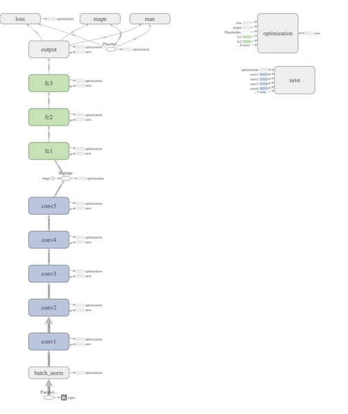
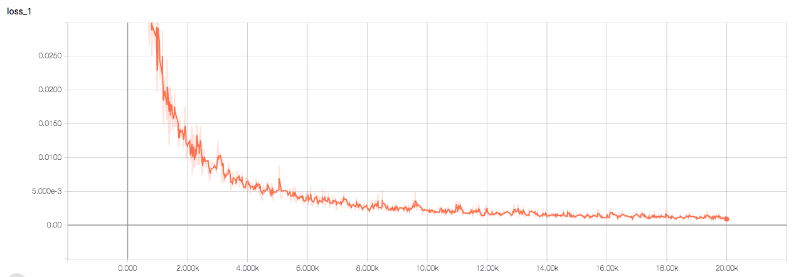

# End-to-End-Learning-for-Self-Driving-Cars
## Introduction

This project is a tensorflow implementation of [End to End Learning for Self-Driving Cars](https://arxiv.org/abs/1604.07316). It trains an convolutional neural network (CNN) to learn a map from raw images to sterring command.

## Requirements

- Tensorflow >= r0.14
- opencv, numpy

## Howto

- Download the [dataset](https://drive.google.com/file/d/0B-KJCaaF7elleG1RbzVPZWV4Tlk/view?usp=sharing)
- Split the dataset: `python split_data.py`

```shell
✗ python split_data.py -h
usage: split_data.py [-h] [--data_dir DATA_DIR] [--seed SEED]
                     [--train_prop TRAIN_PROP]
                     [--validation_prop VALIDATION_PROP]

optional arguments:
  -h, --help            show this help message and exit
  --data_dir DATA_DIR   Directory of data
  --seed SEED           random seed to generate train, validation and test set
  --train_prop TRAIN_PROP
                        The proportion of train set in all data
  --validation_prop VALIDATION_PROP
                        The proportion of validation set in all data
```

- Train the model: `python train.py`

```shell
✗ python train.py -h
usage: train.py [-h] [--max_steps MAX_STEPS] [--print_steps PRINT_STEPS]
                [--learning_rate LEARNING_RATE] [--batch_size BATCH_SIZE]
                [--data_dir DATA_DIR] [--log_dir LOG_DIR]
                [--model_dir MODEL_DIR] [--disable_restore DISABLE_RESTORE]

optional arguments:
  -h, --help            show this help message and exit
  --max_steps MAX_STEPS
                        Number of steps to run trainer
  --print_steps PRINT_STEPS
                        Number of steps to print training loss
  --learning_rate LEARNING_RATE
                        Initial learning rate
  --batch_size BATCH_SIZE
                        Train batch size
  --data_dir DATA_DIR   Directory of data
  --log_dir LOG_DIR     Directory of log
  --model_dir MODEL_DIR
                        Directory of saved model
  --disable_restore DISABLE_RESTORE
                        Whether disable restore model from model directory
```

- Visualize your training procedure: `tensorboard --logdir=./logs`
- Test on the test set: `python test.py`

```shell
✗ python test.py -h
usage: test.py [-h] [--data_dir DATA_DIR] [--model_dir MODEL_DIR]

optional arguments:
  -h, --help            show this help message and exit
  --data_dir DATA_DIR   Directory of data
  --model_dir MODEL_DIR
                        Directory of saved model
```


## Training Results

The model structure visualized by tensorboard:



The training loss:



The test results:

```shell
Loss (MSE) in test dataset: 0.016554169347
MAE in test dataset:  0.0626648643461
```

# ACKNOWLEDGEMENTS

Thanks to [Sully Chen](https://github.com/SullyChen) for the dataset.